# Exploratory Data Analysis

[<< Go back](../README.md)
## Feature : target
- **Feature type** : continous
- **Missing** : 0.0%
- **Unique** : 254
- **Count** :41257.0
- **Mean** :201.7487456674019
- **Std** :33.88667447308463
- **Min** :13.0
- **25%th Percentile** : 193.0
- **50%th Percentile** : 205.0
- **75%th Percentile** : 216.0
- **Max** :572.0

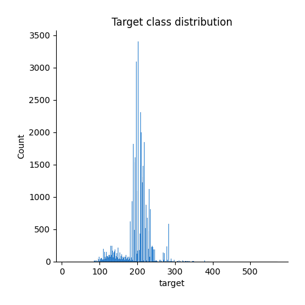
## Feature : lib_mrq
- **Feature type** : categorical
- **Missing** : 0.0%
- **Unique** : 44
- **Count** :41257
- **Unique** :44
- **Top** :MERCEDES
- **Freq** :27132

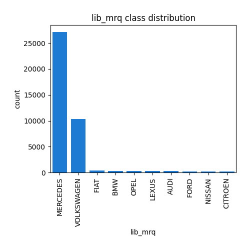
## Feature : lib_mod_doss
- **Feature type** : categorical
- **Missing** : 0.0%
- **Unique** : 450
- **Count** :41257
- **Unique** :450
- **Top** :VIANO
- **Freq** :10560

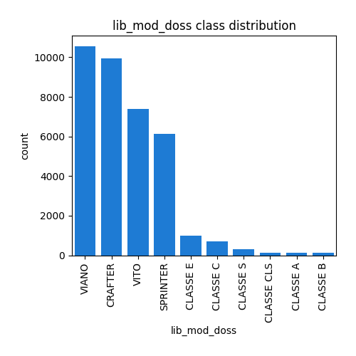
## Feature : lib_mod
- **Feature type** : categorical
- **Missing** : 0.0%
- **Unique** : 418
- **Count** :41257
- **Unique** :418
- **Top** :VIANO
- **Freq** :10560

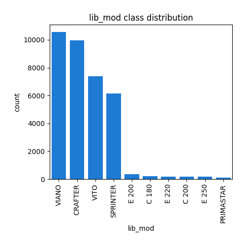
## Feature : dscom
- **Feature type** : categorical
- **Missing** : 0.0%
- **Unique** : 3118
- **Count** :41257
- **Unique** :3118
- **Top** :VIANO 2.2 CDI
- **Freq** :4416

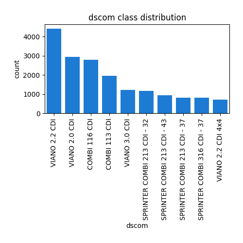
## Feature : cnit
- **Feature type** : text
- **Missing** : 0.0%
- **Unique** : 41221
- **Count** :41257
- **Unique** :41221
- **Top** :M10PELVP253J536
- **Freq** :2

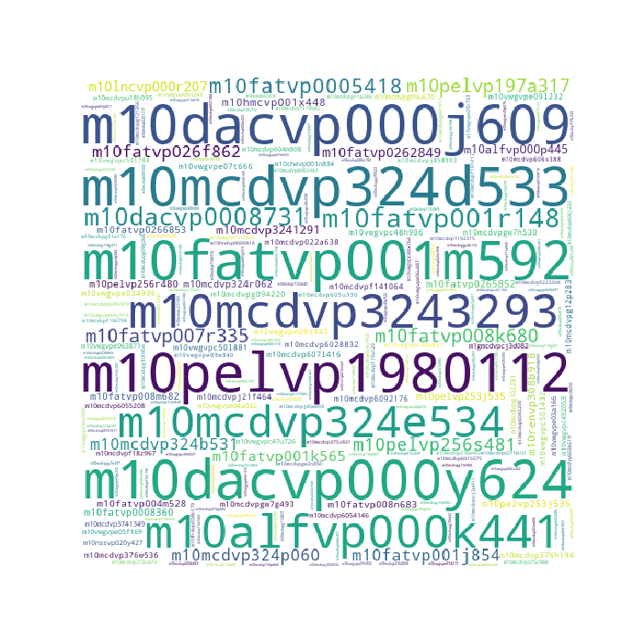
## Feature : tvv
- **Feature type** : text
- **Missing** : 0.0%
- **Unique** : 29465
- **Count** :41257
- **Unique** :29465
- **Top** :639/2LAA31305N1M3G2S37
- **Freq** :4

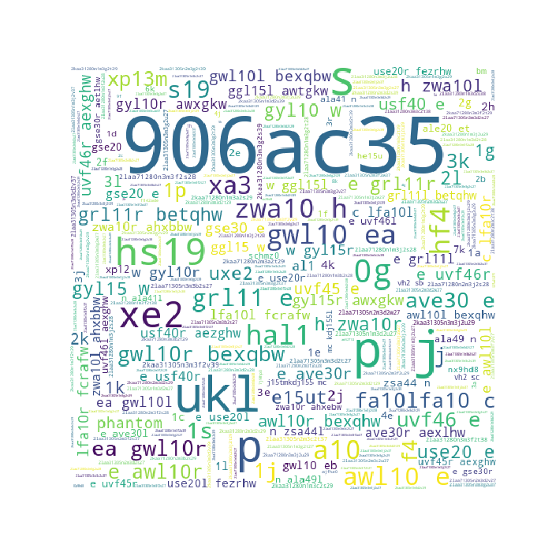
## Feature : cod_cbr
- **Feature type** : categorical
- **Missing** : 0.0%
- **Unique** : 11
- **Count** :41257
- **Unique** :11
- **Top** :GO
- **Freq** :37030

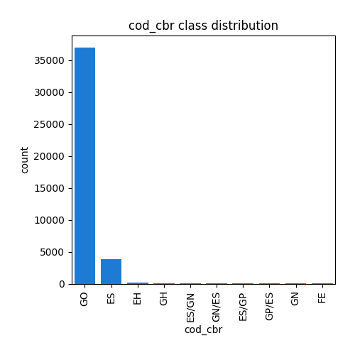
## Feature : hybride
- **Feature type** : categorical
- **Missing** : 0.0%
- **Unique** : 2
- **Count** :41257
- **Unique** :2
- **Top** :non
- **Freq** :40979

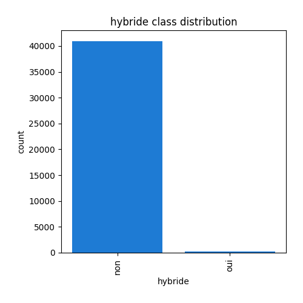
## Feature : puiss_admin_98
- **Feature type** : discrete
- **Missing** : 0.0%
- **Unique** : 63
- **Count** :41257.0
- **Mean** :10.544489419977216
- **Std** :5.067267571540942
- **Min** :3.0
- **25%th Percentile** : 9.0
- **50%th Percentile** : 10.0
- **75%th Percentile** : 10.0
- **Max** :81.0

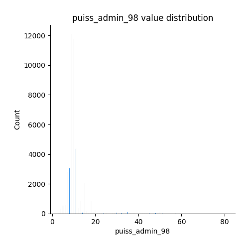
## Feature : puiss_max
- **Feature type** : categorical
- **Missing** : 0.0%
- **Unique** : 220
- **Count** :41257
- **Unique** :220
- **Top** :120
- **Freq** :15011

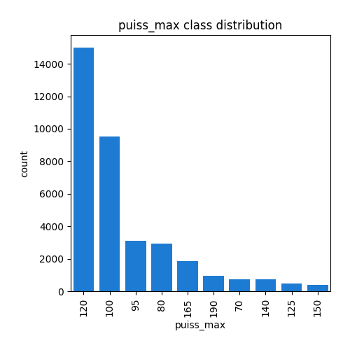
## Feature : typ_boite_nb_rapp
- **Feature type** : categorical
- **Missing** : 0.0%
- **Unique** : 15
- **Count** :41257
- **Unique** :15
- **Top** :M 6
- **Freq** :23894

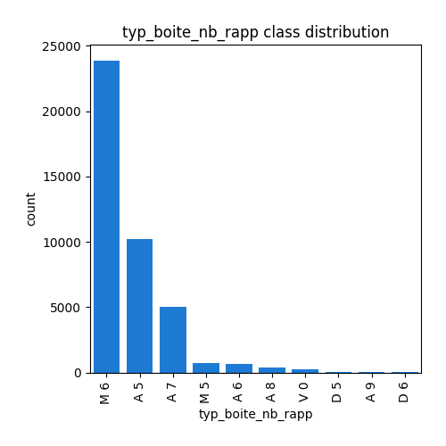
## Feature : conso_urb
- **Feature type** : categorical
- **Missing** : 0.014542986644690599%
- **Unique** : 191
- **Count** :41251
- **Unique** :191
- **Top** :8,899999619
- **Freq** :2809

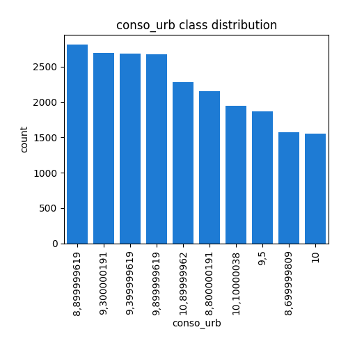
## Feature : conso_exurb
- **Feature type** : categorical
- **Missing** : 0.014542986644690599%
- **Unique** : 89
- **Count** :41251
- **Unique** :89
- **Top** :6,900000095
- **Freq** :4216

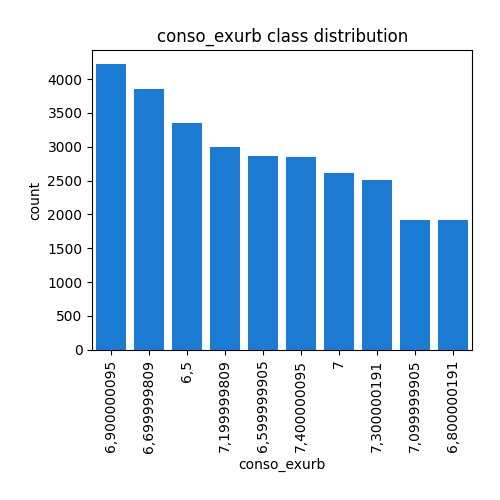
## Feature : conso_mixte
- **Feature type** : categorical
- **Missing** : 0.0%
- **Unique** : 133
- **Count** :41257
- **Unique** :133
- **Top** :8
- **Freq** :4054

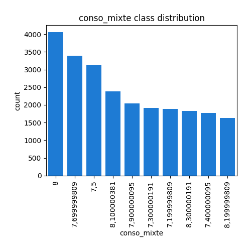
## Feature : co_typ_1
- **Feature type** : categorical
- **Missing** : 0.235111617422498%
- **Unique** : 586
- **Count** :41160
- **Unique** :586
- **Top** :0,046
- **Freq** :5739

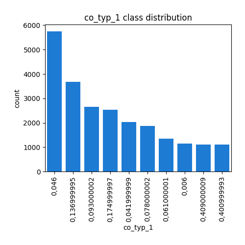
## Feature : nox
- **Feature type** : categorical
- **Missing** : 0.235111617422498%
- **Unique** : 218
- **Count** :41160
- **Unique** :218
- **Top** :0,196999997
- **Freq** :5732

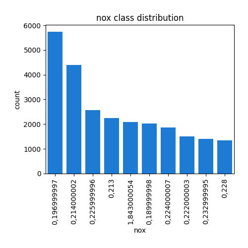
## Feature : ptcl
- **Feature type** : categorical
- **Missing** : 4.777371112780862%
- **Unique** : 9
- **Count** :39286
- **Unique** :9
- **Top** :0,001
- **Freq** :20762

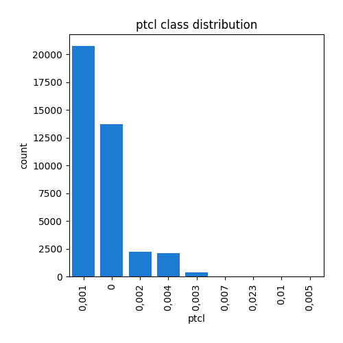
## Feature : masse_ordma_min
- **Feature type** : discrete
- **Missing** : 0.0%
- **Unique** : 783
- **Count** :41257.0
- **Mean** :2103.870421988996
- **Std** :294.0755919540435
- **Min** :825.0
- **25%th Percentile** : 1982.0
- **50%th Percentile** : 2076.0
- **75%th Percentile** : 2246.0
- **Max** :2760.0

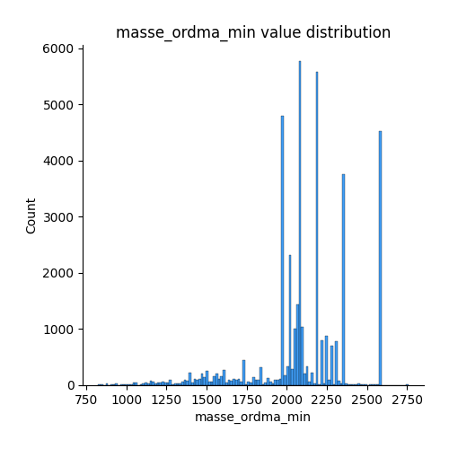
## Feature : masse_ordma_max
- **Feature type** : discrete
- **Missing** : 0.0%
- **Unique** : 848
- **Count** :41257.0
- **Mean** :2343.755605109436
- **Std** :423.2733680660022
- **Min** :825.0
- **25%th Percentile** : 2075.0
- **50%th Percentile** : 2355.0
- **75%th Percentile** : 2709.0
- **Max** :3094.0

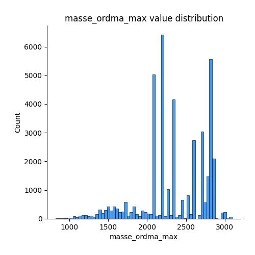
## Feature : champ_v9
- **Feature type** : categorical
- **Missing** : 0.04847662214896866%
- **Unique** : 34
- **Count** :41237
- **Unique** :34
- **Top** :"715/2007*692/2008EURO5
- **Freq** :17988

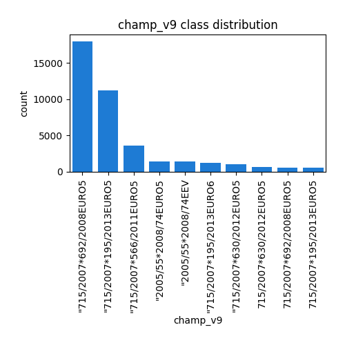
## Feature : Carrosserie
- **Feature type** : categorical
- **Missing** : 0.0%
- **Unique** : 11
- **Count** :41257
- **Unique** :11
- **Top** :MINIBUS
- **Freq** :34647

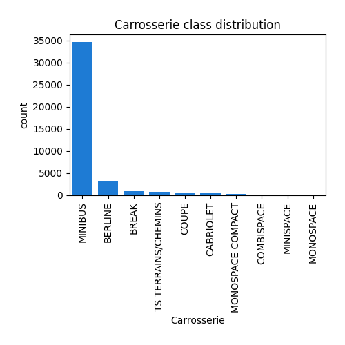
## Feature : gamme
- **Feature type** : categorical
- **Missing** : 0.0%
- **Unique** : 7
- **Count** :41257
- **Unique** :7
- **Top** :MOY-INFER
- **Freq** :25115

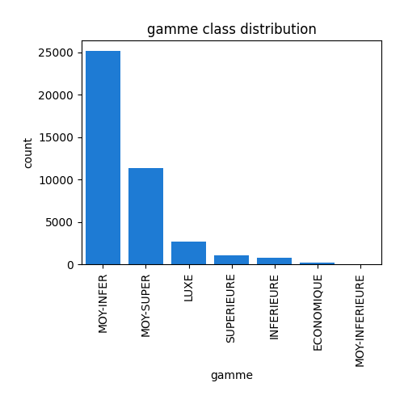

[<< Go back](../README.md)
